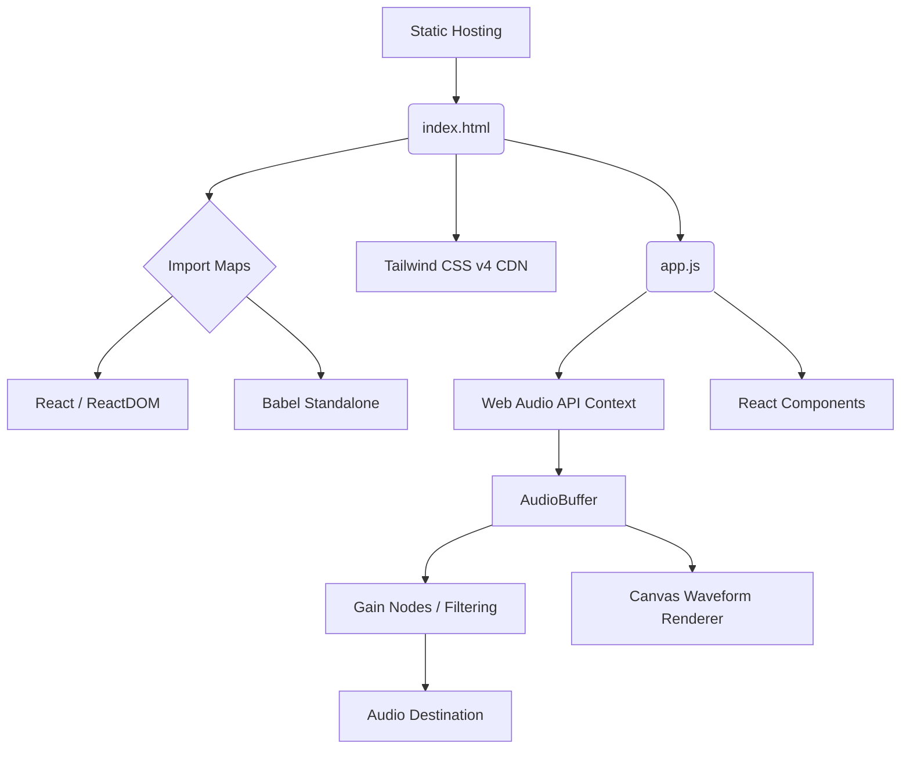

# Earshot // Dre DarkLabs

**Earshot** is a CC0 Audio Auditioning and Browser-Editing Platform, built entirely using a no-build React stack. It operates fully client-side via the Web Audio API, offering a zero-latency, highly responsive environment for auditioning, visualising, and performing non-destructive edits on CC0 audio assets.

This project is part of the experimental **Dre DarkLabs** suite.

## Architecture Overview

Earshot operates entirely in the browser, leveraging the Web Audio API for playback and the Canvas API for waveform visualisation. The application is served statically via GitHub Pages.



## Application Variants

Earshot is deployed in three distinct tiers, all running from the same root directory structure but isolated in their scopes:

1. **Community Version (`/`)**: A highly accessible, forward-facing application for users to audition and rate CC0 audio. Includes instant waveform rendering, mock key/BPM display, and colour-coded visual tagging.
2. **Commercial / Pro Version (`/pro/`)**: Built for commercial licensing workflows. Extends the community version with advanced (mocked) export options, bulk processing pipelines, and team collaboration placeholders.
3. **Admin / Creator Version (`/admin/`)**: A private, mobile-first interface meticulously calibrated for stylus (Samsung S Pen) interaction using the Pointer Events API. Designed for high-precision audio chopping on the go.

## Design Philosophy & Accessibility

*   **No Build Stack:** Uses a raw `index.html` referencing Babel standalone, React from CDNs via import maps, and Tailwind v4. No Node.js build processes are required to run or edit this project.
*   **ADHD-Friendly UI:** Designed with high contrast (utilising Dre Darkroom's signature `#690000` accent and `bg-neutral-950`), progressive disclosure of settings, and zero unnecessary animations.
*   **Zero AI Generation:** This platform is strictly for auditioning and editing *existing* CC0 audio. No generative audio AI is present or planned.
*   **Responsive & Tactile:** Features instant visual feedback, latency-free audio triggering, and distinct colour-coding for SFX vs. Music stems.

## Running Locally

Any static file server will work. For example, using Python 3:

```bash
cd earshot
python3 -m http.server 8000
# Then open http://localhost:8000
```
